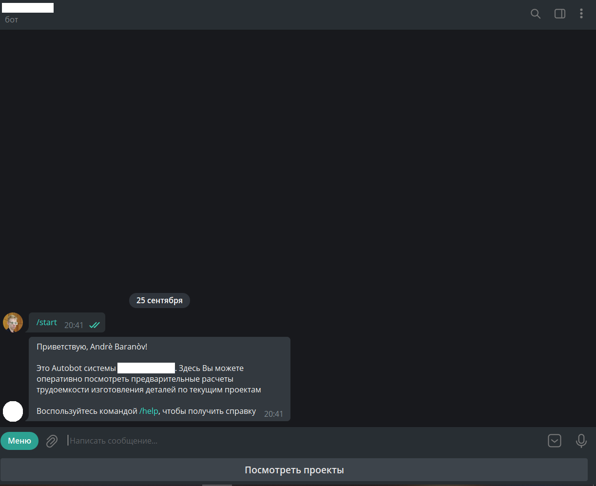
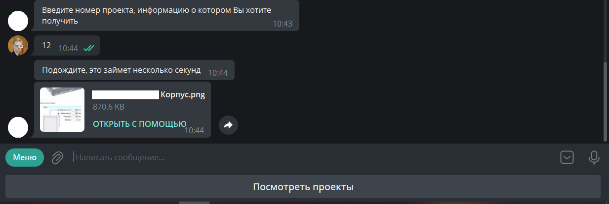

# Project description
Repository contains files of ProjectZ Telegram Bot. 

This bot was created for company that has different projects. Now its participants can monitor that projects
fastly and easily (without using site).

This project uses Python libraries (version 3.8) such as:
+ selenium
+ aiogram
+ etc

# Demonstration

